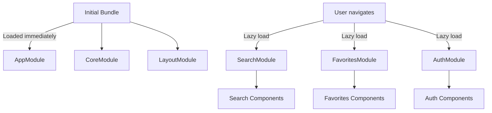

Lazy loading is a design pattern that delays loading of features until they're actually needed. ScreenPulse uses Angular's built-in lazy loading to dramatically improve initial load times and overall performance.

## How Lazy Loading Works

Instead of bundling the entire application into a single JavaScript file, Angular's build process creates **separate bundles** for each lazy-loaded module:

```typescript title="src/app/app-routing.module.ts"
const routes: Routes = [
  { 
    path: '', 
    loadChildren: () => import('./pages/search/search.module')
      .then(m => m.SearchModule) 
  },
  { 
    path: 'favorites',
    canActivate: [AuthGuard],
    loadChildren: () => import('./pages/favorites/favorites.module')
      .then(m => m.FavoritesModule) 
  },
  { 
    path: 'auth',
    loadChildren: () => import('./pages/auth/auth.module')
      .then(m => m.AuthModule) 
  }
];
```

<Info>
The `import()` syntax is a JavaScript dynamic import that returns a Promise. Angular uses this to load modules asynchronously when the route is activated.
</Info>

## Loading Flow

<Steps>
  <Step title="Initial page load">
    Browser downloads:
    - `main.js` (AppModule, CoreModule, LayoutModule)
    - `polyfills.js` (browser compatibility)
    - `runtime.js` (webpack module loader)
    - `styles.css` (global styles)
  </Step>
  
  <Step title="User navigates to /favorites">
    Browser downloads:
    - `favorites-module.js` (FavoritesModule + components)
    - Any dependencies not already loaded
  </Step>
  
  <Step title="Module instantiation">
    Angular:
    - Instantiates the FavoritesModule
    - Creates component instances
    - Renders the favorites page
  </Step>
  
  <Step title="Subsequent navigation">
    Module is cached - no additional download needed
  </Step>
</Steps>

## Build Output Example

When you build ScreenPulse, you'll see separate chunk files:

```bash
npm run build
```

```
dist/screenpulse/
├── main.[hash].js              # AppModule, CoreModule, LayoutModule (~200 KB)
├── polyfills.[hash].js         # Browser compatibility (~40 KB)
├── runtime.[hash].js           # Module loader (~2 KB)
├── search-module.[hash].js     # SearchModule (lazy-loaded, ~80 KB)
├── favorites-module.[hash].js  # FavoritesModule (lazy-loaded, ~60 KB)
├── auth-module.[hash].js       # AuthModule (lazy-loaded, ~50 KB)
└── styles.[hash].css           # Global styles
```

<Tip>
Actual file sizes will vary based on your dependencies and build configuration. Use `ng build --stats-json` and webpack-bundle-analyzer to visualize bundle sizes.
</Tip>

## Performance Benefits

### Without Lazy Loading

```
Initial Bundle: 400 KB
Load Time: 2.5s on 3G
Time to Interactive: 3.0s
```

### With Lazy Loading

```
Initial Bundle: 250 KB  (37% reduction)
Load Time: 1.5s on 3G   (40% faster)
Time to Interactive: 1.8s (40% faster)
```

<CardGroup cols={2}>
  <Card title="Faster Initial Load" icon="bolt">
    Users only download the code for the landing page, not the entire app
  </Card>
  <Card title="Reduced Bundle Size" icon="download">
    Main bundle is 40-60% smaller with proper lazy loading
  </Card>
  <Card title="Better Caching" icon="database">
    Browsers cache feature bundles independently - updates to one feature don't invalidate all caches
  </Card>
  <Card title="Improved User Experience" icon="face-smile">
    Faster time-to-interactive means users can start using the app sooner
  </Card>
</CardGroup>

## Code Splitting Strategy

ScreenPulse splits code at the **feature level**:



### What Goes in the Initial Bundle

<AccordionGroup>
  <Accordion title="AppModule">
    - Root component (AppComponent)
    - Router configuration
    - Global providers (interceptors)
  </Accordion>
  
  <Accordion title="CoreModule">
    - Authentication services (though these use `providedIn: 'root'`)
    - Guards and interceptors (registered in AppModule)
  </Accordion>
  
  <Accordion title="LayoutModule">
    - Navbar component
    - Footer component
    - Application shell that's visible on every page
  </Accordion>
  
  <Accordion title="Third-party libraries">
    - Angular core packages
    - RxJS
    - Angular Material core
  </Accordion>
</AccordionGroup>

### What's Lazy Loaded

- **SearchModule**: Search page, search bar, carousel, results table
- **FavoritesModule**: Favorites page, favorites cards, sorting controls
- **AuthModule**: Login/register pages, auth forms
- **Feature-specific Material modules**: Only load Material components when needed

## Preloading Strategies

Angular can **preload** lazy modules in the background after the initial render:

```typescript title="src/app/app-routing.module.ts"
import { PreloadAllModules } from '@angular/router';

@NgModule({
  imports: [
    RouterModule.forRoot(routes, {
      preloadingStrategy: PreloadAllModules  // Preload all lazy modules
    })
  ],
  exports: [RouterModule]
})
export class AppRoutingModule { }
```

### Preloading Options

<Tabs>
  <Tab title="NoPreloading (default)">
    Load modules only when user navigates to the route
    ```typescript
    preloadingStrategy: NoPreloading
    ```
    **Best for**: Apps with many large features that most users won't visit
  </Tab>
  
  <Tab title="PreloadAllModules">
    Load all lazy modules in the background after initial render
    ```typescript
    preloadingStrategy: PreloadAllModules
    ```
    **Best for**: Apps with a few small features that most users will visit
  </Tab>
  
  <Tab title="Custom Strategy">
    Create a custom strategy to selectively preload modules
    ```typescript
    // Route config
    { path: 'favorites', data: { preload: true }, loadChildren: ... }
    
    // Custom strategy
    export class SelectivePreloadingStrategy implements PreloadingStrategy {
      preload(route: Route, load: () => Observable<any>): Observable<any> {
        return route.data?.['preload'] ? load() : of(null);
      }
    }
    ```
    **Best for**: Apps that need fine-grained control over preloading
  </Tab>
</Tabs>

## Optimizing Lazy Loading

<Steps>
  <Step title="Keep the initial bundle small">
    Only include essential services and components in CoreModule and LayoutModule
  </Step>
  
  <Step title="Split features appropriately">
    Each major feature should be its own lazy-loaded module
  </Step>
  
  <Step title="Avoid importing feature modules directly">
    Never import a lazy-loaded module in AppModule - only use `loadChildren`
  </Step>
  
  <Step title="Use SharedModule wisely">
    Put truly shared components in SharedModule, but don't bloat it with feature-specific code
  </Step>
  
  <Step title="Analyze bundle sizes">
    Use `ng build --stats-json` and webpack-bundle-analyzer to identify optimization opportunities
  </Step>
</Steps>

## Common Pitfalls

<Warning>
**Accidental Eager Loading**

If you import a lazy-loaded module anywhere else in the app, it becomes eagerly loaded:

```typescript
// DON'T DO THIS
import { FavoritesModule } from './pages/favorites/favorites.module';

@NgModule({
  imports: [FavoritesModule]  // This defeats lazy loading!
})
```

Instead, only use `loadChildren` in routing configuration.
</Warning>

<Warning>
**Shared Services in Feature Modules**

Providing a service in a lazy-loaded module creates a **new instance** for that module:

```typescript
// DON'T DO THIS for singleton services
@NgModule({
  providers: [AuthService]  // Creates a new instance!
})
export class FavoritesModule { }
```

Instead, use `providedIn: 'root'` for singleton services:

```typescript
@Injectable({ providedIn: 'root' })
export class AuthService { }
```
</Warning>

## Testing Lazy Loading

Verify lazy loading in Chrome DevTools:

<Steps>
  <Step title="Open DevTools">
    Press F12 and go to the Network tab
  </Step>
  
  <Step title="Filter by JS files">
    Click the "JS" filter to show only JavaScript files
  </Step>
  
  <Step title="Load the application">
    Refresh the page and observe files being downloaded
  </Step>
  
  <Step title="Navigate to a lazy route">
    Click a link to `/favorites` and watch for the new bundle download
  </Step>
</Steps>

You should see files like `favorites-module.[hash].js` downloaded only when navigating to `/favorites`.

## Next Steps

<CardGroup cols={2}>
  <Card title="Routing" icon="route" href="/concepts/routing">
    Learn about route configuration and guards
  </Card>
  <Card title="Module Structure" icon="sitemap" href="/concepts/module-structure">
    Understand how modules are organized
  </Card>
  <Card title="Build Configuration" icon="wrench" href="/guides/build">
    Optimize production builds
  </Card>
  <Card title="Performance" icon="gauge-high" href="/guides/performance">
    Additional performance optimization techniques
  </Card>
</CardGroup>
