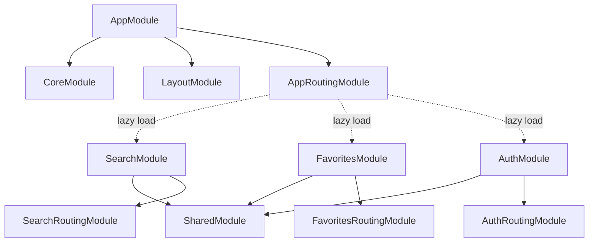

ScreenPulse organizes functionality into distinct Angular modules with specific responsibilities. This modular approach promotes code reusability, maintainability, and efficient lazy loading.

## CoreModule

The **CoreModule** contains singleton services, guards, interceptors, and application-wide configuration. It should be imported **only once** in the root AppModule.

### Structure

```
core/
├── guards/
│   └── auth.guard.ts          # Route protection
├── interceptors/
│   ├── auth.interceptor.ts    # JWT token injection
│   └── error.interceptor.ts   # Global error handling
├── services/
│   ├── auth.service.ts        # Authentication state
│   └── user.service.ts        # User API calls
├── constants/
│   └── featured-media.const.ts
└── core.module.ts
```

### Implementation

```typescript title="src/app/core/core.module.ts"
import { NgModule } from '@angular/core';
import { CommonModule } from '@angular/common';

@NgModule({
  declarations: [],
  imports: [CommonModule]
})
export class CoreModule { }
```

<Note>
CoreModule is intentionally minimal because services use `providedIn: 'root'` for automatic singleton behavior. Guards and interceptors are registered in AppModule's providers array.
</Note>

### Core Services

Core services manage application-wide state and functionality:

```typescript title="src/app/core/services/auth.service.ts"
@Injectable({
  providedIn: 'root'
})
export class AuthService {
  private readonly authTokenKey = 'authToken';
  private readonly userMailKey = 'userMail';
  
  private userMailSubject = new BehaviorSubject<string | null>(null);
  private userLoggedInSubject = new BehaviorSubject<boolean>(false);

  constructor() {
    this.userMailSubject.next(sessionStorage.getItem(this.userMailKey));
    this.userLoggedInSubject.next(
      sessionStorage.getItem(this.authTokenKey) !== null
    );
  }

  setUserSession(user: AuthUser, token: string) {
    this.setAuthToken(token);
    this.setUserMail(user.email);
    this.setUserName(user.name);
  }

  isLoggedInObservable(): Observable<boolean> {
    return this.userLoggedInSubject.asObservable();
  }

  logOut() {
    sessionStorage.removeItem(this.authTokenKey);
    sessionStorage.removeItem(this.userMailKey);
    this.userMailSubject.next(null);
    this.userLoggedInSubject.next(false);
  }
}
```

### Guards

Guards protect routes from unauthorized access:

```typescript title="src/app/core/guards/auth.guard.ts"
@Injectable({
  providedIn: 'root'
})
export class AuthGuard implements CanActivate {
  constructor(
    private authService: AuthService,
    private router: Router,
    private toastService: ToastrService
  ) { }

  canActivate(): Observable<boolean> {
    return this.authService.isLoggedInObservable().pipe(
      take(1),
      tap(loggedIn => {
        if (!loggedIn) {
          this.toastService.warning(
            'You must be logged in to access this page.',
            'Access Denied'
          );
          this.router.navigate(['/auth/login']);
        }
      })
    );
  }
}
```

### Interceptors

Interceptors modify HTTP requests and responses globally:

```typescript title="src/app/core/interceptors/auth.interceptor.ts"
@Injectable()
export class AuthInterceptor implements HttpInterceptor {
  constructor(
    private router: Router,
    private authService: AuthService
  ) {}

  intercept(
    req: HttpRequest<unknown>,
    next: HttpHandler
  ): Observable<HttpEvent<unknown>> {
    const token = this.authService.getAuthToken();
    let authReq = req;
    
    if (token) {
      authReq = req.clone({
        setHeaders: { Authorization: `Bearer ${token}` }
      });
    }
    
    return next.handle(authReq).pipe(
      catchError((error: HttpErrorResponse) => {
        if (error.status === 401) {
          this.authService.logOut();
          this.router.navigate(['/auth/login']);
        }
        return throwError(() => error);
      })
    );
  }
}
```

<Info>
Interceptors are registered in AppModule using the `HTTP_INTERCEPTORS` token with `multi: true` to allow multiple interceptors in the chain.
</Info>

## SharedModule

The **SharedModule** exports reusable components, directives, pipes, and commonly-used Angular Material modules. It's imported by feature modules that need these shared resources.

### Structure

```
shared/
├── components/
│   ├── loading-spinner/
│   ├── empty-state/
│   ├── movie-dialog/
│   └── trailer-dialog/
├── directives/
│   └── fallback-images.directive.ts
├── services/
│   ├── omdb/
│   ├── favorites/
│   └── dialog/
├── models/
│   ├── movie.model.ts
│   ├── auth.model.ts
│   └── search.model.ts
└── shared.module.ts
```

### Implementation

```typescript title="src/app/shared/shared.module.ts"
import { NgModule } from '@angular/core';
import { CommonModule } from '@angular/common';
import { FormsModule, ReactiveFormsModule } from '@angular/forms';

// Angular Material Modules
import { MatToolbarModule } from '@angular/material/toolbar';
import { MatTableModule } from '@angular/material/table';
import { MatIconModule } from '@angular/material/icon';
import { MatButtonModule } from '@angular/material/button';
import { MatCardModule } from '@angular/material/card';
// ... more Material modules

import { OmdbService } from './services/omdb/omdb.service';
import { MediaItemDialogComponent } from './components/movie-dialog/movie-dialog.component';
import { LoadingSpinnerComponent } from './components/loading-spinner/loading-spinner.component';
import { EmptyStateComponent } from './components/empty-state/empty-state.component';
import { FallbackImagesDirective } from './directives/fallback-images.directive';

const MATERIAL_MODULES = [
  MatToolbarModule,
  MatTableModule,
  MatIconModule,
  MatButtonModule,
  MatCardModule,
  // ... more modules
];

@NgModule({
  declarations: [
    MediaItemDialogComponent,
    LoadingSpinnerComponent,
    EmptyStateComponent,
    FallbackImagesDirective
  ],
  imports: [
    CommonModule,
    FormsModule,
    ReactiveFormsModule,
    ...MATERIAL_MODULES
  ],
  providers: [OmdbService],
  exports: [
    ...MATERIAL_MODULES,
    MediaItemDialogComponent,
    LoadingSpinnerComponent,
    EmptyStateComponent,
    FallbackImagesDirective
  ]
})
export class SharedModule { }
```

<Tip>
Grouping Material modules into a constant array (`MATERIAL_MODULES`) keeps the module clean and makes it easy to add or remove modules.
</Tip>

## LayoutModule

The **LayoutModule** contains application shell components like the navbar and footer. It's imported once in AppModule.

```typescript title="src/app/layout/layout.module.ts"
import { NgModule } from '@angular/core';
import { CommonModule } from '@angular/common';
import { RouterModule } from '@angular/router';
import { MatToolbarModule } from '@angular/material/toolbar';
import { MatIconModule } from '@angular/material/icon';
import { MatButtonModule } from '@angular/material/button';
import { NavbarComponent } from './navbar/navbar.component';
import { FooterComponent } from './footer/footer.component';

@NgModule({
  declarations: [
    NavbarComponent,
    FooterComponent
  ],
  imports: [
    CommonModule,
    RouterModule,
    MatToolbarModule,
    MatIconModule,
    MatButtonModule
  ],
  exports: [
    NavbarComponent,
    FooterComponent
  ]
})
export class LayoutModule { }
```

## Feature Modules

Feature modules encapsulate specific application features and are lazy-loaded via the router.

### Search Module Example

```typescript title="src/app/pages/search/search.module.ts"
import { NgModule } from '@angular/core';
import { CommonModule } from '@angular/common';
import { SearchRoutingModule } from './search-routing.module';
import { SearchComponent } from './page/search.component';
import { SharedModule } from 'src/app/shared/shared.module';
import { SearchCoverComponent } from './components/search-cover/search-cover.component';
import { MediaItemResultsTableComponent } from './components/movie-results-table/movie-results-table.component';
import { CarouselComponent } from './components/carousel/carousel.component';
import { SearchBarComponent } from './components/search-bar/search-bar.component';

@NgModule({
  declarations: [
    SearchComponent,
    SearchCoverComponent,
    MediaItemResultsTableComponent,
    CarouselComponent,
    SearchBarComponent
  ],
  imports: [
    CommonModule,
    SearchRoutingModule,
    SharedModule,
    FormsModule,
    ReactiveFormsModule
  ]
})
export class SearchModule { }
```

## Module Import Rules

<AccordionGroup>
  <Accordion title="CoreModule">
    - Import **only once** in AppModule
    - Contains singleton services with `providedIn: 'root'`
    - Guards and interceptors registered in AppModule providers
  </Accordion>
  
  <Accordion title="SharedModule">
    - Import in **every feature module** that needs shared resources
    - Exports reusable components, directives, pipes
    - Exports commonly-used third-party modules (Material, Forms)
  </Accordion>
  
  <Accordion title="LayoutModule">
    - Import **only once** in AppModule
    - Contains application shell components
    - Exports navbar and footer
  </Accordion>
  
  <Accordion title="Feature Modules">
    - **Never imported directly** - only via lazy loading
    - Import SharedModule for common functionality
    - Self-contained with own routing module
  </Accordion>
</AccordionGroup>

## Module Dependency Graph



## Best Practices

<Steps>
  <Step title="Single Responsibility">
    Each module should have a clear, single purpose (authentication, shared utilities, etc.)
  </Step>
  
  <Step title="Avoid Circular Dependencies">
    CoreModule should never import feature modules, and feature modules shouldn't import each other
  </Step>
  
  <Step title="Use providedIn: 'root'">
    For singleton services, use `providedIn: 'root'` instead of adding to module providers
  </Step>
  
  <Step title="Export Selectively">
    Only export what other modules need to use - keep internal components private
  </Step>
</Steps>

## Next Steps

<CardGroup cols={2}>
  <Card title="Routing" icon="route" href="/concepts/routing">
    Learn how modules are lazy-loaded via routing
  </Card>
  <Card title="Services" icon="gears" href="/concepts/services">
    Deep dive into service architecture
  </Card>
  <Card title="Lazy Loading" icon="rocket" href="/concepts/lazy-loading">
    Understand code splitting and performance
  </Card>
  <Card title="Architecture" icon="building" href="/concepts/architecture">
    Return to architecture overview
  </Card>
</CardGroup>
