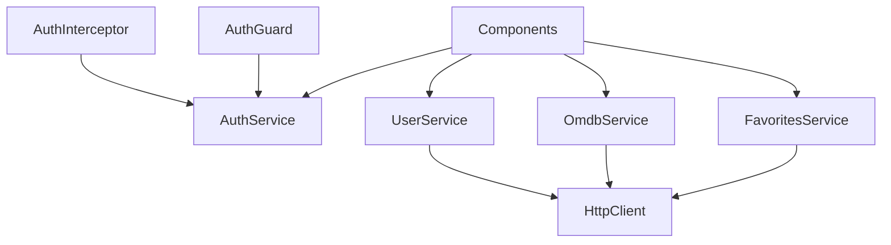

Services are the backbone of ScreenPulse's architecture. They encapsulate business logic, manage state, handle HTTP requests, and provide reusable functionality across components.

## What are Services?

In Angular, services are **singleton classes** that provide specific functionality to components and other services. They're decorated with `@Injectable()` to enable dependency injection.

<Info>
Services follow the **Single Responsibility Principle** - each service should have one clear purpose, such as managing authentication or making API calls.
</Info>

## Service Types in ScreenPulse

ScreenPulse organizes services into two categories:

### Core Services

Located in `core/services/`, these manage application-wide concerns:

```
core/services/
├── auth.service.ts    # Authentication state management
└── user.service.ts    # User API operations
```

### Shared Services

Located in `shared/services/`, these provide feature-specific functionality used across modules:

```
shared/services/
├── omdb/
│   └── omdb.service.ts         # OMDB API integration
├── favorites/
│   └── favorites.service.ts    # Favorites management
└── dialog/
    └── dialog.service.ts       # Material Dialog abstraction
```

## providedIn: 'root'

Modern Angular services use `providedIn: 'root'` to declare themselves as application-wide singletons:

```typescript title="src/app/core/services/auth.service.ts"
import { Injectable } from '@angular/core';
import { BehaviorSubject, Observable } from 'rxjs';

@Injectable({
  providedIn: 'root'  // Creates a singleton instance
})
export class AuthService {
  private userMailSubject = new BehaviorSubject<string | null>(null);
  private userLoggedInSubject = new BehaviorSubject<boolean>(false);

  constructor() {
    // Initialize state from sessionStorage
    this.userMailSubject.next(sessionStorage.getItem('userMail'));
    this.userLoggedInSubject.next(
      sessionStorage.getItem('authToken') !== null
    );
  }

  isLoggedInObservable(): Observable<boolean> {
    return this.userLoggedInSubject.asObservable();
  }

  getUserMailObservable(): Observable<string | null> {
    return this.userMailSubject.asObservable();
  }

  setUserSession(user: AuthUser, token: string) {
    sessionStorage.setItem('authToken', token);
    sessionStorage.setItem('userMail', user.email);
    sessionStorage.setItem('userName', user.name);
    this.userMailSubject.next(user.email);
    this.userLoggedInSubject.next(true);
  }

  logOut() {
    sessionStorage.removeItem('authToken');
    sessionStorage.removeItem('userMail');
    sessionStorage.removeItem('userName');
    this.userMailSubject.next(null);
    this.userLoggedInSubject.next(false);
  }
}
```

<Note>
`providedIn: 'root'` means:
- Angular creates a **single instance** of the service when the app starts
- The service is available **application-wide** without importing it in a module
- It's **tree-shakable** - if no component uses it, it won't be included in the bundle
</Note>

## HTTP Services

Services that interact with APIs inject Angular's `HttpClient`:

```typescript title="src/app/core/services/user.service.ts"
import { HttpClient, HttpHeaders } from '@angular/common/http';
import { Injectable } from '@angular/core';
import { Observable } from 'rxjs';
import { LoginResponse, RegisterResponse, User } from 'src/app/shared/models/auth.model';
import { environment } from 'src/environments/environment.development';

@Injectable({
  providedIn: 'root'
})
export class UserService {
  private baseUrl = environment.serverUserURL;

  constructor(private http: HttpClient) { }

  login(formData: User): Observable<LoginResponse> {
    const httpOptions = {
      headers: new HttpHeaders({
        'Content-Type': 'application/json',
      }),
    };
    return this.http.post<LoginResponse>(
      `${this.baseUrl}/login`,
      formData,
      httpOptions
    );
  }

  register(formData: User): Observable<User> {
    const httpOptions = {
      headers: new HttpHeaders({
        'Content-Type': 'application/json',
      }),
    };
    return this.http.post<RegisterResponse>(
      `${this.baseUrl}/register`,
      formData,
      httpOptions
    );
  }
}
```

### HTTP Service Pattern

<Steps>
  <Step title="Inject HttpClient">
    Add `HttpClient` to the constructor
  </Step>
  
  <Step title="Define base URL">
    Store API base URL from environment configuration
  </Step>
  
  <Step title="Create typed methods">
    Return `Observable<T>` with proper TypeScript types
  </Step>
  
  <Step title="Let components subscribe">
    Don't subscribe in the service - let components handle subscriptions
  </Step>
</Steps>

<Tip>
Return observables from HTTP services instead of subscribing within the service. This gives components control over when and how to handle the response.
</Tip>

## Service Responsibilities

### AuthService

Manages authentication state and session storage:

<AccordionGroup>
  <Accordion title="State Management">
    - Maintains login status via `BehaviorSubject`
    - Exposes observables for components to react to changes
    - Provides synchronous getters for immediate values
  </Accordion>
  
  <Accordion title="Session Storage">
    - Stores auth token, user email, and username
    - Initializes state from sessionStorage on app load
    - Clears storage on logout
  </Accordion>
  
  <Accordion title="Observable Streams">
    - `isLoggedInObservable()`: Authentication status
    - `getUserMailObservable()`: Current user's email
    - Components subscribe to receive real-time updates
  </Accordion>
</AccordionGroup>

### UserService

Handles user-related API operations:

- **login()**: Authenticates user and returns token
- **register()**: Creates new user account
- Returns typed observables for components to handle responses

### OmdbService

Integrates with the OMDB API:

- **fetchMediaItems()**: Searches for movies/shows
- **fetchMediaDetails()**: Gets detailed information
- Handles query parameter construction
- Transforms API responses to internal models

### FavoritesService

Manages user's favorite media items:

- **addToFavorites()**: Saves media item to backend
- **removeFromFavorites()**: Deletes media item
- **getFavorites()**: Retrieves user's favorites
- Communicates with backend API using HttpClient

## Dependency Injection

Angular's dependency injection system provides service instances to components and other services:

```typescript title="src/app/pages/search/page/search.component.ts"
import { Component } from '@angular/core';
import { OmdbService } from 'src/app/shared/services/omdb/omdb.service';
import { FavoritesService } from 'src/app/shared/services/favorites/favorites.service';
import { AuthService } from 'src/app/core/services/auth.service';
import { Router } from '@angular/router';
import { ToastrService } from 'ngx-toastr';

export class SearchComponent {
  constructor(
    private omdbService: OmdbService,
    private toastrService: ToastrService,
    private favoritesService: FavoritesService,
    private authService: AuthService,
    private router: Router,
    private dialogService: DialogService
  ) { }

  addToFavorites(mediaItem: MediaItem) {
    this.authService.isLoggedInObservable().pipe(
      take(1),
      switchMap(loggedIn => {
        if (!loggedIn) {
          this.toastrService.warning(
            'You must be logged in to add movies to your list',
            'Error'
          );
          this.router.navigate(['/auth/login']);
          return EMPTY;
        }
        return this.favoritesService.addToFavorites(mediaItem);
      })
    ).subscribe({
      next: () => this.toastrService.success(
        mediaItem.title,
        'Added to favorites'
      ),
      error: (error) => this.toastrService.warning(error.message)
    });
  }
}
```

<Info>
Angular automatically creates and injects service instances. You never use `new AuthService()` - Angular handles instantiation via dependency injection.
</Info>

## Service Communication

Services can communicate with each other:

```typescript
// AuthInterceptor depends on AuthService
@Injectable()
export class AuthInterceptor implements HttpInterceptor {
  constructor(
    private router: Router,
    private authService: AuthService  // Inject another service
  ) {}

  intercept(
    req: HttpRequest<unknown>,
    next: HttpHandler
  ): Observable<HttpEvent<unknown>> {
    const token = this.authService.getAuthToken();
    
    if (token) {
      req = req.clone({
        setHeaders: { Authorization: `Bearer ${token}` }
      });
    }
    
    return next.handle(req);
  }
}
```

## Testing Services

Services are easily testable because of dependency injection:

```typescript
import { TestBed } from '@angular/core/testing';
import { AuthService } from './auth.service';

describe('AuthService', () => {
  let service: AuthService;

  beforeEach(() => {
    TestBed.configureTestingModule({});
    service = TestBed.inject(AuthService);
  });

  it('should be created', () => {
    expect(service).toBeTruthy();
  });

  it('should initialize as logged out', () => {
    service.isLoggedInObservable().subscribe(loggedIn => {
      expect(loggedIn).toBe(false);
    });
  });
});
```

## Service Best Practices

<Steps>
  <Step title="Use providedIn: 'root' for singletons">
    Creates a single instance across the application automatically
  </Step>
  
  <Step title="Return observables from HTTP methods">
    Let components control subscriptions and error handling
  </Step>
  
  <Step title="Expose observables, not subjects">
    Use `.asObservable()` to prevent external code from emitting values
  </Step>
  
  <Step title="Keep services focused">
    Each service should have a single, clear responsibility
  </Step>
  
  <Step title="Use TypeScript types">
    Define interfaces for API responses and service methods
  </Step>
  
  <Step title="Handle errors at the component level">
    Services provide data; components decide how to display errors
  </Step>
</Steps>

## Service Anti-Patterns

<Warning>
**Don't subscribe in services**

```typescript
// BAD
export class UserService {
  login(user: User) {
    this.http.post('/api/login', user).subscribe(...);
  }
}

// GOOD
export class UserService {
  login(user: User): Observable<LoginResponse> {
    return this.http.post<LoginResponse>('/api/login', user);
  }
}
```

Let components handle subscriptions so they can control error handling and lifecycle.
</Warning>

<Warning>
**Don't provide services in multiple modules**

```typescript
// BAD - Creates multiple instances
@NgModule({
  providers: [AuthService]
})
export class FeatureModule { }

// GOOD - Use providedIn: 'root'
@Injectable({ providedIn: 'root' })
export class AuthService { }
```

Using `providedIn: 'root'` ensures a singleton instance.
</Warning>

## Service Hierarchy



## Next Steps

<CardGroup cols={2}>
  <Card title="RxJS Patterns" icon="diagram-project" href="/concepts/rxjs">
    Learn about observables and reactive programming
  </Card>
  <Card title="Reactive Patterns" icon="arrows-spin" href="/concepts/reactive-patterns">
    Advanced patterns for reactive applications
  </Card>
  <Card title="HTTP Interceptors" icon="filter" href="/guides/http-interceptors">
    Transform HTTP requests globally
  </Card>
  <Card title="Testing" icon="flask" href="/guides/testing">
    Write unit tests for services
  </Card>
</CardGroup>
